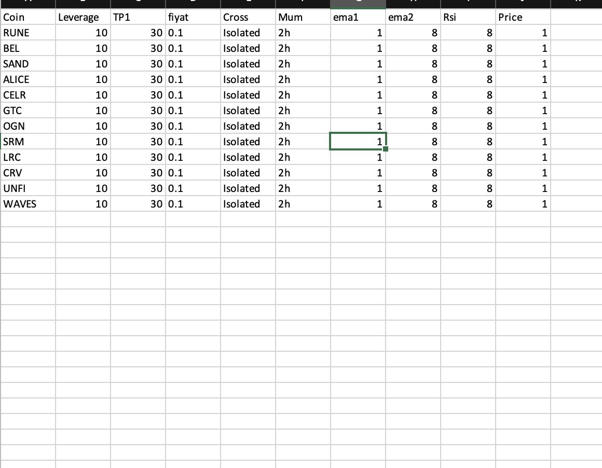

# Summary
The system trades on the features exchange using rsi and ema information. The system has 2 different codes:
normal.py: trading with normal bars.
heikinashi.py: trading with heikin ashi.

# System Description

Some missing binance functions have been completed in the BinanceClass class.

data is given to the system from 'data.xlxs'. the excele file contains the headers of the data
 <figure>

</figure>

The system buy and sell logic is as follows: buy if ema1 cuts ema2 upwards and rsi1 is higher than rsi2.

sell if ema2 cuts ema1 downwards and rsi2 is higher than rsi1.


script that allows us to connect to the binance apis

``` python
api_key=""
secret_key=""
binance = BinanceFuturesClient(api_key,secret_key,False)
data=pd.read_excel("data.xlsx")
client=Client(api_key,secret_key)

client=Client(api_key=api_key,api_secret=secret_key, tld="com")

```

function that allows us to create heikin ashi bars
``` python

def get_history(symbol, interval, start, end = None):
    bars = client.futures_historical_klines(symbol = symbol, interval = interval,
                                        start_str = start, end_str = end, limit = 1000)
  
    df = pd.DataFrame(bars)
    df["Date"] = pd.to_datetime(df.iloc[:,0], unit = "ms")
    df.columns = ["Open Time", "Open", "High", "Low", "Close", "Volume",
                  "Clos Time", "Quote Asset Volume", "Number of Trades",
                  "Taker Buy Base Asset Volume", "Taker Buy Quote Asset Volume", "Ignore", "Date"]
    df = df[["Date", "Open", "High", "Low", "Close", "Volume"]].copy()
    df.set_index("Date", inplace = True)
    heikin_ashi_df = df.copy()
    #heikin_ashi_df = pd.DataFrame(index=df.index.values, columns=['open', 'high', 'low', 'close'])
    heikin_ashi_df['Close'] = (df['Open'].astype(float) + df['High'].astype(float) + df['Low'].astype(float) + df['Close'].astype(float)) / 4
    a=df['Open'].iloc[0]
    for i in range(len(df)):
        if i == 0:
            heikin_ashi_df.iat[0, 0] = float(df['Open'].iloc[0])
        else:
            heikin_ashi_df.iat[i, 0] = (heikin_ashi_df.iat[i-1, 0] + heikin_ashi_df.iat[i-1, 3]) / 2
        
    heikin_ashi_df['High'] = heikin_ashi_df.loc[:, ['Open', 'Close']].join(df['High']).max(axis=1)
    
    heikin_ashi_df['Low'] = heikin_ashi_df.loc[:, ['Open', 'Close']].join(df['Low']).min(axis=1)
    for column in heikin_ashi_df.columns:
         heikin_ashi_df[column] = pd.to_numeric(heikin_ashi_df[column], errors = "coerce")
    
    return  heikin_ashi_df    

```